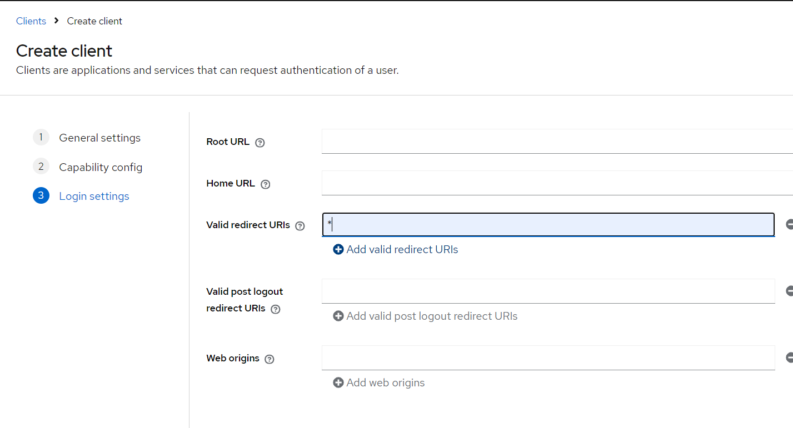
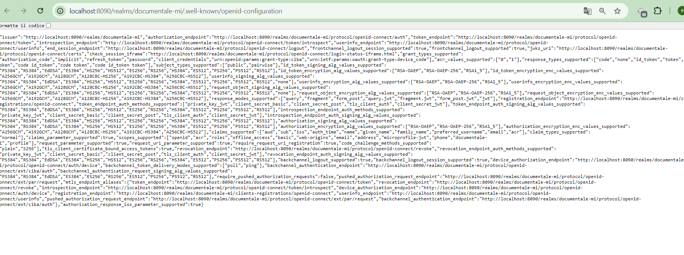

# documentale-mi-gateway

Requirements before start:
-
- JDK 17
- Docker Desktop /  Rancher Desktop
- Maven
- IDEA (IntelliJ IDEA Community Edition / Eclipse )

components:
-
- api-gateway
- discovery-server

Steps to running this app in local:
- 
1- lunch command compose up in terminal in /local folder: 
```
docker compose up -d / nerdctl compose -f docker-compose.yaml up -d
```

2- configure keycloak:

after docker compose up correctly navigate to : http://localhost:8090
sin-in with admin/admin 


create new realm in our case documentale-mi:


create new client in our realm click next and save:




create new scope and save:


now go to clients list and choose our client and in add our new scope :


create new user and set credentials:


in realm setting you can find all information for configure your app:




3- run discover server with maven command:

``` mvn spring-boot:run ```


open browser in http://localhost:8761 and log-in with the credentials you can find in application.yaml 


for now there is no application registered yet


4- run api-gateway
run api-gateway 


now you can see api-gateway is registered in discovery server


5- Test: now navigate to our api-gateway utl: http://localhost:8080/token
it should be open keycloak login page like you can see in the image below


you can sign-in with the user we created before, in first step you have to change password:


this endpoint return a JWT token our service is up and running and the keycloak configuration works


we see how to start keycloak from a docker-compose and a simple configuration,
and how to run discovery server and api-gateway in our machine